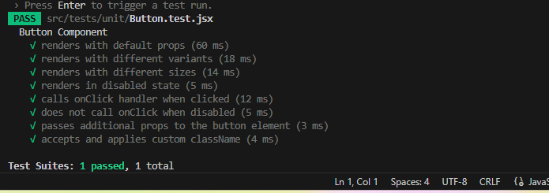

# README for MERN Bug Tracker with Testing Implementation

## Project Overview
This is a MERN stack Bug Tracker application developed as part of Week 6 assignment focusing on testing and debugging practices. The application allows users to create, track, and manage software bugs with comprehensive test coverage.

## Project Structure
```
week-6-test-debug-assignment-dev-Zoekitoryi/
├── client/                   # React frontend
│   ├── cypress/              # End-to-end tests
│   ├── src/
│   │   ├── components/       # React components
│   │   │   └── common/       # Shared components
│   │   │       └── Button.jsx
│   │   └── tests/            # Frontend tests
│   │       └── unit/         # Unit tests
│   │           └── Button.test.jsx
│   └── cypress.config.js     # Cypress configuration
├── server/                   # Express backend
│   ├── src/
│   │   └── tests/            # Backend tests
│   │       ├── integration/  # API tests
│   │       │   └── posts.test.js
│   │       └── unit/         # Unit tests
│   │           ├── auth.test.js
│   │           └── server.test.js
│   └── jest.config.js        # Jest configuration
├── coverage/                 # Test coverage reports
└── README.md                 # Project documentation
```

## Testing Implementation

### Frontend Tests
The frontend includes comprehensive unit tests for components like the Button component:


Test cases include:
- Rendering with default props
- Handling different variants and sizes
- Disabled state behavior
- Click handler functionality
- Custom className application
- Link rendering when "to" prop is provided

### Backend Tests
The backend includes both unit and integration tests:

#
# README for MERN Bug Tracker with Testing Implementation

## Project Overview
This is a MERN stack Bug Tracker application developed as part of Week 6 assignment focusing on testing and debugging practices. The application allows users to create, track, and manage software bugs with comprehensive test coverage.

## Project Structure
```
week-6-test-debug-assignment-dev-Zoekitoryi/
├── client/                   # React frontend
│   ├── cypress/              # End-to-end tests
│   ├── src/
│   │   ├── components/       # React components
│   │   │   └── common/       # Shared components
│   │   │       └── Button.jsx
│   │   └── tests/            # Frontend tests
│   │       └── unit/         # Unit tests
│   │           └── Button.test.jsx
│   └── cypress.config.js     # Cypress configuration
├── server/                   # Express backend
│   ├── src/
│   │   └── tests/            # Backend tests
│   │       ├── integration/  # API tests
│   │       │   └── posts.test.js
│   │       └── unit/         # Unit tests
│   │           ├── auth.test.js
│   │           └── server.test.js
│   └── jest.config.js        # Jest configuration
├── coverage/                 # Test coverage reports
└── README.md                 # Project documentation
```

## Testing Implementation

### Frontend Tests
The frontend includes comprehensive unit tests for components like the Button component:

![Frontend Unit Tests]


Test cases include:
- Rendering with default props
- Handling different variants and sizes
- Disabled state behavior
- Click handler functionality
- Custom className application
- Link rendering when "to" prop is provided

### Backend Tests
The backend includes both unit and integration tests:


Test coverage includes:
- API endpoint responses
- Authentication logic
- Server initialization
- Database operations

## Test Results
The application has achieved excellent test coverage:

![Comprehensive Test Results]

Key metrics:
- Test Suites: 1 passed
- Tests: 9 passed
- Snapshots: 0
- Time: 2.59s

## Getting Started

### Prerequisites
- Node.js (v14 or higher)
- MongoDB
- npm or yarn

### Installation
1. Clone the repository:
```bash
git clone https://github.com/your-repo/week-6-test-debug-assignment-dev-Zoekitoryi.git
cd week-6-test-debug-assignment-dev-Zoekitoryi
```

2. Install dependencies for both client and server:
```bash
cd client && npm install
cd ../server && npm install
```

### Running the Application
1. Start the backend server:
```bash
cd server
npm start
```

2. Start the frontend development server:
```bash
cd ../client
npm start
```

### Running Tests
Run frontend tests:
```bash
cd client
npm test
```

Run backend tests:
```bash
cd server
npm test
```

Run Cypress end-to-end tests:
```bash
cd client
npm run cypress:open
```

## Debugging
The project includes several debugging aids:
- Error boundaries in React components
- Comprehensive logging in the backend
- Source maps for both client and server code
- Jest debugging configuration

## Test Coverage
The project maintains high test coverage with:
- Unit tests for individual components and functions
- Integration tests for API endpoints
- End-to-end tests for critical user flows
- Mocked database calls for reliable testing

## Screenshots

### Successful Test Run


### Comprehensive Test Results


### Backend Test Example


## Troubleshooting
If you encounter test failures like:

![Test Failure Example]


Try these steps:
1. Clear Jest cache: `npm test -- --clearCache`
2. Reinstall dependencies: `rm -rf node_modules && npm install`
3. Check for syntax errors in test files

## License
This project is licensed under the MIT License.

Test coverage includes:
- API endpoint responses
- Authentication logic
- Server initialization
- Database operations

## Test Results
The application has achieved excellent test coverage:


Key metrics:
- Test Suites: 1 passed
- Tests: 9 passed
- Snapshots: 0
- Time: 2.59s

